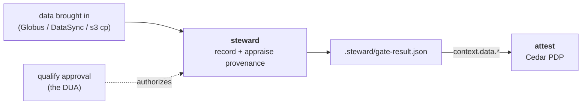

# steward

**Data-ingestion stewardship for AWS Secure Research Environments.**

> **Boundary:** steward owns the **data plane's move-to-compute boundary** — it records the
> provenance of data brought *into* a secure account, appraises it, and writes the attribute attest's
> PDP gates a read on. Where [vet](https://github.com/provabl/vet) qualifies the *software* and
> [qualify](https://github.com/provabl/qualify) qualifies the *person*, steward qualifies the *data*.
> It does **not** move bytes (the mover is pluggable/external), decide access (attest does), or build
> the account (ground does).

Part of the [Provabl](https://provabl.dev) suite:
- **[ground](https://ground.provabl.dev)** — deploy correct AWS foundations
- **[attest](https://attest.provabl.dev)** — compile, enforce, and prove compliance
- **[qualify](https://qualify.provabl.dev)** — train and qualify researchers
- **[vet](https://vet.provabl.dev)** — verify the software supply chain
- **steward** — govern data brought into the boundary ← you are here

> Ground your infrastructure, attest your controls, qualify your people, vet your software.

---

## What steward does

The compute-to-data model (provabl ADR 0002) lets an SRE reach a dataset *in place*. Its sibling,
**move-to-compute** — copying data *into* the SRE (a Globus transfer to S3, a bulk load) — was
unowned: the suite could prove the person, the software, the machine, and the network path, but
*nothing about a dataset that was copied in*. steward closes that: it records where the bytes came
from and that they're intact, checks the ingestion was authorized against a current
[DUA](https://github.com/provabl/provabl/blob/main/docs/guide/glossary.md#dua-data-use-agreement),
and lowers a verified-provenance attribute attest's Cedar PDP gates the data-read on.



**Governance, not transport.** steward does not move bytes — Globus/DataSync/`s3 cp` do. steward wraps
that movement with the governance the suite was missing: an authorization check, a recorded
provenance record, and (later) handling/retention and closeout.

## Core concepts

(terms link to the suite [glossary](https://github.com/provabl/provabl/blob/main/docs/guide/glossary.md))

- **[Move-to-compute](https://github.com/provabl/provabl/blob/main/docs/guide/glossary.md#move-to-compute)** — data is transferred *into* the SRE (vs [compute-to-data](https://github.com/provabl/provabl/blob/main/docs/guide/glossary.md#compute-to-data), where it's reached in place). steward governs the former.
- **Provenance record** — source URI, content digest, transfer-integrity result, governing DUA, authorizing principal: *what came in, from where, under what authority.* The move-to-compute analogue of vet's SBOM/verification record.
- **`data://` [(ASP, appraiser) pair](https://github.com/provabl/provabl/blob/main/docs/guide/glossary.md#asp-attestation-service-provider)** — steward registers one against the [evidence kernel](https://github.com/provabl/provabl/blob/main/docs/guide/glossary.md#evidence-kernel), so the provenance is *appraised and fresh*, not a bare assertion.
- **[Lowered attribute](https://github.com/provabl/provabl/blob/main/docs/guide/glossary.md#lowered-attribute)** — the verdict becomes `.steward/gate-result.json` (→ `context.data.*`); attest reads it. **attest stays the [PDP](https://github.com/provabl/provabl/blob/main/docs/guide/glossary.md#pdp-policy-decision-point); steward never decides.**

## Install

```bash
go install github.com/provabl/steward/cmd/steward@latest   # requires Go 1.26.4+
# or build from a clone: go build ./cmd/steward
```

**Prerequisites.** Go 1.26.4+. The provenance record/gate/log flow runs locally with no AWS access;
`provenance verify` (digest re-check against an object) needs read access to the destination. Run
`steward preflight` to confirm the calling principal holds what the AWS-touching paths need.

## Status

🚧 **Under active development** — v1 (provenance record/verify, the `data://` appraisal gate, log,
preflight) is being built. Transport (the mover), S3 Object Lock handling, and closeout/destruction
are deferred follow-ons. See `business/steward-product-spec.md` (in the umbrella) and provabl ADR 0004.

## License

Apache 2.0. Copyright 2026 Playground Logic LLC.
